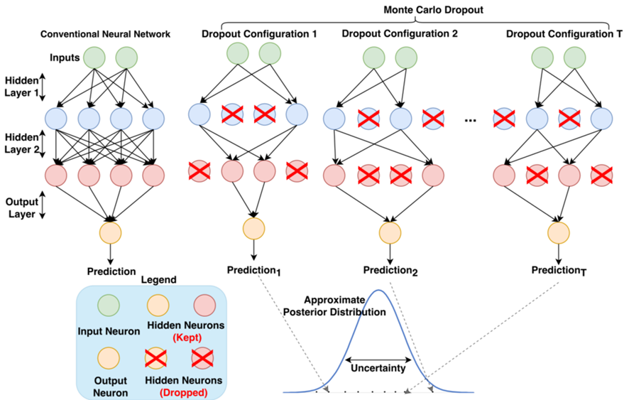

Lancaster AI (**LAI**) reading group is a weekly reading group focusing on topics related to AI, including but not limited to: diffusion models, information geometry, stochastic optimisation, geometric deep learning. It will be more tutorial-styled, instead of seminar-styled, tailored more towards people who wish to learn more about the recent developments of AI. This reading group is supported by the [Prob_AI Hub](https://www.probai.uk/).

In Term 1, we are doing **optimisation for machine learning**.

In Term 2, we are doing **Bayesian deep learning**. 

In Term 3, we are doing **trends in Machine Learning**. If you are interested in giving a talk please contact [Andreas](mailto:a.makris@lancaster.ac.uk) or [Cass](mailto:c.durr@lancaster.ac.uk).

[**PSC Lab 2 and over Teams; Wednesday 3-4pm (mostly)**]{style="color:Blue"}.

See [here](./schedule.html) for the **full schedules**; [here](./past.html) for **past sessions**.

### Next Session

| Title | Location | Date | Time | Speaker |
|:------------------:|:-----------:|:-----------:|:-----------:|:-----------:|
| ODEFormer | PSC Lab 2 | 6 May 2026 | 3 pm - 4 pm | Cass |

Email [Andreas](mailto:a.makris@lancaster.ac.uk) or [Cass](mailto:c.durr@lancaster.ac.uk) for any question related to the reading group. 

The popular [Dropout MC method](https://arxiv.org/abs/1506.02142). Image taken from [here](https://www.themoonlight.io/tw/review/testing-spintronics-implemented-monte-carlo-dropout-based-bayesian-neural-networks).
